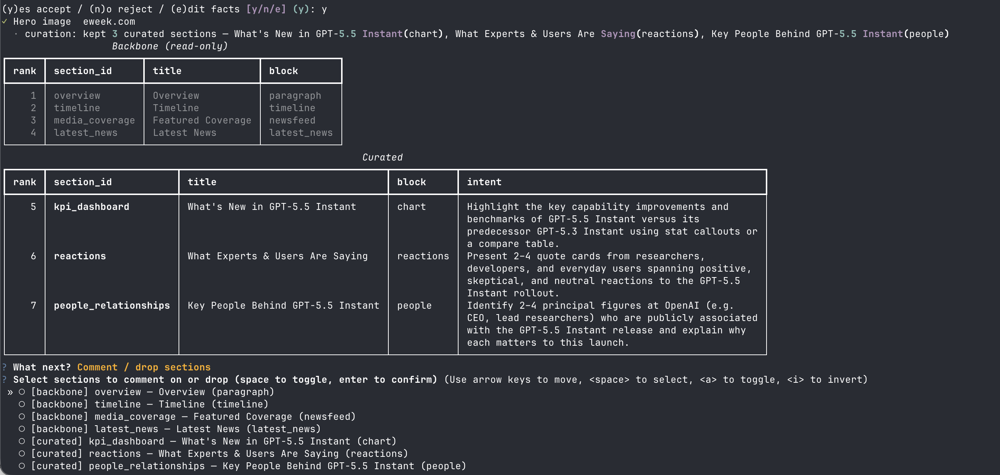
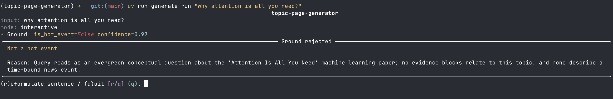
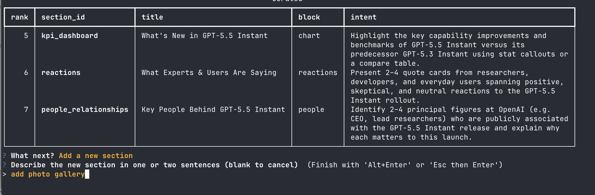

# Design Document — Topic Page Generator

> Take-home design doc. Companion artifacts: four built HTML pages under `output/`, the runnable CLI documented in `README.md`, the full data contract in [`schema.md`](./schema.md).

## Contents

- [0. TL;DR](#0-tldr)
- [1. Product decisions](#1-product-decisions)
- [2. System architecture](#2-system-architecture)
- [3. Data contract & schema](#3-data-contract--schema)
- [4. Prompt engineering](#4-prompt-engineering)
- [5. Information sourcing](#5-information-sourcing)
- [6. Visual & UX](#6-visual--ux)
- [7. Failure modes](#7-failure-modes)
- [8. Tradeoffs & what I'd do with another week](#8-tradeoffs--what-id-do-with-another-week)

---

## 0. TL;DR

**Product.** An editor-in-the-loop topic page generator for non-technical users. The system drafts a complete page from a single sentence; the editor steers it at four HITL gates (ground facts, section plan, extracted sections, final page) or runs the same pipeline in fully autonomous mode. The intent is to give the editor a *sliding control* over how much autonomy the system has.

**Pipeline.** LLMs are confined to the genuinely fuzzy tasks: gating, fact extraction, curation, on-demand section proposal, per-section block writing. Orchestration, source fetch, schema validation, rendering, and delivery are deterministic code. Every stage's output is a Pydantic-validated typed object; on validation failure the stage retries with the error fed back into the prompt, or falls through with a recorded outcome.

**Data contract.** Every fact-bearing field carries a citation pointing into a frozen evidence pool. Schema validation is the trust boundary between the LLM and the editor — if a section parsed, every claim in it is traceable to a real source. Full contract in [`schema.md`](./schema.md).

**Five example pages, five different event archetypes:**

| Page | Archetype | Input |
|---|---|---|
| [`openai-launches-gpt-5.html`](../output/openai-launches-gpt-5.html) | Tech / product rollout | "OpenAI rolled out GPT-5.5 Instant as the default model in ChatGPT in May 2026" |
| [`eurovision-song-contest-2026.html`](../output/eurovision-song-contest-2026.html) | Live cultural event | "Eurovision 2026 is being held in Vienna from May 12 to May 16." |
| [`2026-fifa-world-cup.html`](../output/2026-fifa-world-cup.html) | Scheduled sports tournament | "The 2026 FIFA World Cup kicks off at Estadio Azteca on June 11, 2026." |
| [`trump-xi-summit-in.html`](../output/trump-xi-summit-in.html) | Geopolitical / diplomatic event | "Trump China summit" |
| [`wwdc-2026-apple-s.html`](../output/wwdc-2026-apple-s.html) | Developer conference / keynote | "WWDC 2026" |

The point of running the system across these five is to show that the *same* generator produces pages whose shape genuinely differs by event type (see §1 and §6). The shorter inputs (`"Trump China summit"`, `"WWDC 2026"`) also exercise the ground stage's ability to enrich a sparse prompt into a full `EventFacts` before the page is planned.

---

## 1. Product decisions

### What is a topic page, as I'm defining it

A hot-event topic page is a **fact-first aggregation surface** organized around the extended 5W1H frame: a single URL where a reader who just heard about an event can, within thirty seconds, see *what happened, who's involved, when, where, why it matters, what's next, and where to read more from real publishers*. The last two — *what's next* and *where to read more* — extend the journalism classic to cover what a feed-trained reader actually wants once the basics are settled. That frame is the editorial brief the generator is being asked to fill, and it's baked into the data model: `EventFacts` (`schema.py`) literally carries `entities`, `what`, `when`, `where`, `why` as required fields, populated by the ground stage before any page-shape decision is made.

### Who this is for, and the autonomy slider

The implicit operator is an editor on deadline — non-technical, time-pressed, accountable for what ships. The framing I picked up from Karpathy is that any AI product should hand its user [a *sliding control* over autonomy](https://www.youtube.com/watch?v=LCEmiRjPEtQ). Roughly four positions on that slider:

1. **Autocomplete-style (ALM)** — the model helps with the next token.
2. **Semi-autonomous (Semi-LM)** — the model drafts; the human re-writes liberally.
3. **Human-in-the-loop (HITL)** — the model plans and executes; the human approves at gates.
4. **Full autonomy** — the model runs end-to-end with no human in the path.

This project ships the bottom two positions and skips the top two deliberately. `uv run generate run "..."` is the **HITL** mode: the editor reviews ground facts, the section plan, the extracted sections, and the final rendered page, and can drop, comment on, or add curated sections before research even starts. `uv run generate run --auto "..."` is the **full-autonomy** mode: every gate auto-accepts, but each decision is still recorded as an `EditorAction` so the trace can tell an evaluator whether a human ever actually saw the page. Skipping the top two (autocomplete-style and semi-autonomous) is the other half of the choice — a topic page is a structured artifact, not prose the editor wants to rewrite token-by-token; an autocomplete or co-drafting UI would land the editor inside the LLM's writing flow, which is exactly the mode this product is supposed to spare them. The lever the product is built around is **letting the editor steer the plan before the expensive stages run** — it's cheaper to drop a doomed section than to research and extract it, and the editor's structural judgment is easier to capture than their prose.

### Why CLI, not a web UI

Two reasons. First, scope: the build is one week and the core problem is generation, not interface design — a CLI keeps iteration speed high and avoids letting frontend work eat the schedule. Second, the user is internal staff. A real product for external editors would warrant a web UI; a take-home pipeline used by internal editors does not. A CLI is also the most honest surface for the trace artifact: every run produces `<slug>.{html, data.json, trace.json}` on disk, and the editor can grep, diff, or re-open any of them without a server.

### Generalizing across event types

The first instinct when scoping this was to enumerate event types — sports, entertainment, politics, economics, tech rollouts, disasters, summits — and design templates for each. I walked away from that. The set of event types is **open and effectively infinite**; trying to exhaust it turns into a content-ops problem dressed up as an engineering one, and the moment a new archetype shows up the system is stale.

So I flipped the framing: instead of asking "what kinds of events exist?", ask "**what does a reader arriving at a hot-event page actually want?**" — and that question has a much older, much narrower answer. Journalism has been answering it for a century with **5W1H** (who, what, when, where, why, how). Five-or-six questions, not five-or-six hundred event types. That's a **closed set**, and a closed set is something a schema and a pipeline can be built around.

**Generalization comes from anchoring on the closed set of reader needs, not from chasing the open set of event types.** Everything that follows in §1 — the topic-page definition, the deterministic backbone, the visual neutrality of the chrome — is a consequence of that one move.


### How the page shape is decided

I deliberately rejected two extremes:

1. **One template with placeholders.** Same six headings, fill in the blanks. Cheap, but every event looks identical and the system has no taste.
2. **Free-form layout generated by an LLM.** Let the model decide the section list, the block kinds, the order, the whole composition. Maximally adaptive, but impossible to audit and indistinguishable from a hallucination machine when it goes wrong.

The compromise I shipped is **deterministic backbone + LLM curation + editor-in-the-loop curation panel.** It's a four-step loop, not a single call:

1. **Backbone planner** (`src/generator/pipeline/backbone_planner.py`) — deterministic, zero LLM calls. Emits exactly **four always-on sections in canonical order**: `overview` (paragraph, main), `timeline` (sidebar), `media_coverage` (newsfeed, main), `latest_news` (latest_news, main). `media_coverage` and `latest_news` are deliberately split: the former is the editor's "what matters" carousel (curated picks, depth/scoops, image-heavy); the latter is the strict chronological "what's newest" feed, sorted by `published_at` DESC with no editorial reranking. These four are the spine every topic page needs regardless of event type.
2. **Curation Planner** (`src/generator/pipeline/curation_planner.py`) — one LLM call that proposes **0–4 additional curated sections** to complement the backbone. The model picks block kinds from an enumerated set, names the sections, and assigns intent. It cannot invent block kinds, cannot duplicate the backbone.
3. **Plan Review — the Curation Panel** (`src/generator/editor/prompt_cli.py::plan_review`) — HITL loop. The editor sees the full proposed plan (backbone read-only + curated editable) and chooses from a menu: *accept-all (optionally with a global comment that applies to every section)*, *comment / drop sections* (multi-select; backbone is comment-only, curated can be dropped), *add a new section*, or *reject the page*. The loop runs until the editor accepts or rejects.
4. **Section Proposer — the Generator** (`src/generator/pipeline/section_proposer.py`) — LLM call, on-demand from the panel. When the editor chooses "add a new section", they describe it in one or two sentences; this single LLM call materializes a `SectionPlan` with `kind="curated"`, `placement="main"`, and a rank appended to the existing list. Defensive guards run after the LLM: backbone-reserved block kinds (`timeline`, `latest_news`) are downgraded to `paragraph`, and any section-id collision gets a counter suffix.

### What I intentionally left out

- **No real-time / post-publish updates.** The page reflects the evidence pool at generation time. A staleness watcher is sketched in §8 but not built.
- **No video / interactive embeds.** Vanilla HTML keeps output portable, auditable, and shippable to anywhere static files render.
- **No editor-facing diff UI.** When a section is regenerated via `regen-section`, the editor re-reads it. A side-by-side diff is a future-week item.

---

## 2. System architecture

### How the pipeline got this shape

The first attempt was a straight feed-forward design: `ground → plan → research → extract → render`. Each stage took the previous stage's output and ran. No loop, no feedback, no human in the middle. It read well as an architecture diagram and produced pages that looked plausible from a distance.

It didn't hold up. Two structural failures, both rooted in the same blind spot — the Planner is choosing which sections to fill *before* anyone has looked at the evidence pool:

- **The Planner doesn't know what's actually findable.** It might ask for a "host-city reactions" section for an event with zero local-press coverage, or a "tariff dashboard" for a summit where no dashboard-worthy numbers exist yet. The pipeline charges ahead and produces a thin, citation-starved section that violates `is_minimum_viable`.
- **There's no look-back.** After research fetches whatever it finds, nothing checks whether the fetched pool actually meets the plan's expectation. A bad pool flows forward into block_extract, which writes whatever it can, and the problem only becomes visible at the end of the run.

The fix is two mechanisms layered onto the same pipeline, one per problem:

- **A simple Evaluator** (`pipeline/research_eval.py`) closes the machine side. Inside each section's research loop, an LLM judge returns `satisfied: bool` + `gaps: list[str]`; `gaps` feeds the next query, `satisfied` exits early. Cheap — one LLM call per iteration, hard-capped — but it's the difference between propagating a bad pool and self-correcting against the plan.
- **A more advanced HITL** closes the human side. The **Curation Panel** (`plan_review`) lets the editor amend the plan *before* research runs — drop sections that won't pay off, add ones the LLM missed, leave per-section notes that thread into research and extraction. `sections_review` does the symmetric thing after extract. The editor often knows what's findable when the Planner doesn't, and gets to act on that before any budget is spent.

What started as a linear pipeline now has one machine-driven loop (per-section research↔eval) and two human-driven loops (`plan_review` and `sections_review`). The subsections below walk through that shape stage by stage.

### The pipeline

The CLI (`src/generator/cli.py::generate`) runs the pipeline below. Every stage is wrapped by `TraceRecorder.stage(...)` (`src/generator/pipeline/trace.py`), which captures model, tokens, cost, duration, retries, and each individual LLM call into the final trace artifact. Four HITL gates sit between stages — each one a place where the editor can steer, comment, or kill the page.

```
input sentence
   │
   ▼
[1] ground             (LLM × 1 + Tavily × 1)   ──→ is_hot_event gate + EventFacts
   │
   ▼  ◀── HITL: ground_review  (accept / reformulate sentence / reject)
   │
[2] hero_image         (Brave image search, best-effort; silently skipped without key)
   │
   ▼
[3] backbone planner   (deterministic, 4 always-on sections)
   │
   ▼
[4] curation planner   (LLM × 1)                ──→ 0–4 curated extras
   │
   ▼  ◀── HITL: plan_review  (Curation Panel — loop)
   │        │  drop curated · comment on any section · add a new section
   │        │  ▼
   │        └─ [4a] section_proposer (Generator, LLM × 1, on-demand)
   │                                            ──→ extra SectionPlan
   │     (loop until editor accepts or rejects; collects EditorNotes)
   │
   ▼
[5] research           (per-section loop: LLM query gen + Tavily ≤30 + LLM eval)
                       (editor notes for the section are merged into the query prompt)
                                                ──→ evidence pool (frozen)
   │
   ▼
[6] block_extract      (LLM × 1 per section; editor notes injected into the prompt)
                                                ──→ RenderedSection[]
   │
   ▼  ◀── HITL: sections_review  (drop bad extractions before render)
   │
[7] render             (deterministic Jinja2)   ──→ HTML
   │
   ▼
[8] deliver            (deterministic file IO)  ──→ <slug>.{html, data.json, trace.json}
   │
   ▼  ◀── HITL: final_approval  (browser preview, approve / reject)
```

### Where the LLM/deterministic boundary sits, and why

| Stage | LLM? | Why this side of the line |
|---|---|---|
| ground | **LLM** | The gate ("is this a hot event worth a page?") and the fact extraction both need to read the Tavily evidence. Putting them in *the same call* costs one round-trip instead of two and gives a single failure mode: either the LLM produces a valid `GroundOutput` or it doesn't. |
| hero_image | deterministic | One Brave image-search call, best-effort. No judgment to delegate; absent key → no hero. |
| backbone planner | deterministic | The four backbone sections are universal. There is no judgment to delegate. |
| curation planner | **LLM** | "Which extra sections would this specific event benefit from?" is exactly the kind of taste call the LLM is good at. Constrained to 0–4 sections, block kinds from a closed set, no content yet. |
| plan_review (Curation Panel) | deterministic UI | The editor's structural edits. No LLM in the loop itself — but it can *call* the section proposer on demand. |
| section_proposer (Generator) | **LLM** | Turns an editor's free-form description into a typed `SectionPlan`. Bounded structured output; post-hoc guards downgrade reserved block kinds and resolve id collisions. |
| research query/eval | **LLM** | Generating a useful Tavily query from a `SectionPlan` is fuzzy. Deciding whether the returned source pool is sufficient is fuzzy. Wrapping both in deterministic budgets keeps the loop bounded. When the editor left a note for the section, it is merged into the query prompt. |
| Tavily fetch | deterministic | HTTP. No judgment. |
| block_extract | **LLM** | Per-section content writing from a frozen source pool. Citations enforced at the schema layer (§3). Editor notes (if any) are injected into the prompt as an `EDITOR_NOTE:` directive. |
| sections_review | deterministic UI | Editor drops extractions that came out badly. Survivors go to render; per-action `EditorAction` is recorded. |
| render | deterministic | HTML must be auditable. The LLM never writes markup. |
| deliver | deterministic | File I/O + the final_approval HITL gate. |

The rule I followed: **LLMs do semantics; code does structure, cost, and I/O.** Everywhere it was tempting to give the LLM more agency (let it decide what to fetch next, let it write its own block, let it choose the layout), I asked whether the win was worth the loss of auditability. Mostly it wasn't.

### Bounded budgets

The research stage has three hard caps (`src/generator/pipeline/research.py:35`):

- `max_iterations_per_section = 3`
- `max_fetch_calls_per_section = 4`
- `max_total_tavily = 50` (global)

Sections run in parallel under a shared budget. When a section's pool is judged sufficient by the research-eval LLM call (the Evaluator from the opening of §2), the section exits early. When budgets are hit, the section exits with whatever it has and the downstream extractor decides whether the pool meets the section's acceptance criteria. **Partial evidence beats unbounded cost; the trace records the gap the Evaluator emitted on the last iteration, so the failure mode is observable rather than silent.**

### Trace as a first-class artifact

Every page produces a `<slug>.trace.json` alongside the HTML and data. The trace captures, per stage: model used, token counts, cost, duration, retry count, error string (if any), and a full list of individual LLM calls with their prompts and responses. For the evaluator's purposes, the trace is the answer to "what did this system actually do, and how much did it cost?"


### HITL — the four wired touchpoints

`EditorPrompter` (`src/generator/editor/prompt_cli.py`) exposes **four** active HITL touchpoints in the live pipeline. Each one records an `EditorAction` into the trace, regardless of outcome.

- **`ground_review`** — between ground and curation. The editor sees the extracted `EventFacts`, can rewrite the sentence in `$EDITOR` and re-run ground, can accept the page as-is, or can reject it (exit code 5).
- **`plan_review`** — between the curation planner and research. This is the **Curation Panel** described in §1: a menu-driven loop where the editor can drop curated sections, comment on any section (backbone or curated), add a new section by calling the **Section Proposer** LLM, leave a global comment, accept, or reject. The loop continues until the editor commits to accept or reject; on accept it returns the surviving curated list and an `EditorNotes` object.
- **`sections_review`** — between block_extract and render. After every section has been extracted, the editor can drop any rendered section whose output isn't worth shipping. Survivors go to render; the trace records each drop.
- **`final_approval`** — after render, before delivery. The editor opens the HTML in a browser and approves or rejects the page.

Screenshots of the `ground_review` reject path and the `plan_review` Curation Panel are in the [Appendix](#appendix-hitl-touchpoints-in-the-cli) at the bottom of this document.

The remaining HITL gap is a side-by-side **diff UI** for re-extracted sections. `regen-section` re-runs block_extract for a single section against the frozen pool, but the editor reads the new section without a diff against the previous one. That's the P0 item in §8.

`--auto` short-circuits all four gates. This is the "full autonomy" position on the Karpathy slider from §1; the default CLI invocation is the HITL position.

---

## 3. Data contract & schema

### Core types

The full contract lives in [`schema.md`](./schema.md) and `src/generator/schema.py`. The shape is:

```
EventPage
├── subject:        EventSubject       (canonical_title, slug, summary)
├── facts:          EventFacts         (entities, what, when, where, why)
├── editorial_sections: list[RenderedSection]
│       ├── section_id
│       ├── block_kind                 ("paragraph" | "timeline" | "chart" | ...)
│       ├── placement                  ("main" | "sidebar")
│       ├── block:    RenderBlock      (discriminated union by `kind`)
│       └── sources_used: list[SourceId]
├── sources:        list[Source]       (the frozen evidence pool)
├── trace:          Trace
└── editor_actions: list[EditorAction]
```

### Citations are not optional

Every fact-bearing field in every block variant carries either a scalar `source_id` (pointing into `EventPage.sources[]`) or a `citations: list[Citation]` array. Schema validation rejects orphan citations (source IDs not present in the pool) and rejects fact-bearing fields with no citation.

---

## 4. Prompt engineering

### Layered prompt structure

`src/generator/prompts/base_preamble.py` defines a shared system preamble injected into every stage. It states the pipeline's purpose, the citation rules, and the evidence-pool format. Stage-specific instructions live in dedicated files: `ground.py`, `curation.py`, `research_query.py`, `research_eval.py`, `block_extract.py`. Splitting the preamble from the stage-specific turn means I can tune one stage's instructions without contaminating the others.

### Structured outputs everywhere

Every LLM call goes through `call_structured(model, messages, response_model)` (`src/generator/llm/client.py`). The model receives a JSON schema derived from the Pydantic `response_model` and is required to return conforming JSON. There is no free-text parsing anywhere in the pipeline. This is the single biggest lever for making LLM output behave like a typed function call instead of a paragraph.

### Where each stage's prompt does its real work

A few decisions in prompt design that I think are non-obvious:

- **Ground does gate-and-extract in one call.** The prompt asks the LLM to decide `is_hot_event` *and*, if true, to extract `EventFacts` grounded in the Tavily sources it was given. I considered splitting these into two calls and chose not to: both decisions need the same context (the input sentence and the same 8 Tavily results), and either both succeed together or neither is useful. One call, one failure mode.
- **Curation receives the enumerated `BlockSpec` list, not free-form options.** The prompt hands the LLM the names and descriptions of every available block kind plus the backbone sections that are already taken. The model picks from this menu; it can't invent kinds, and it can't duplicate the backbone. Duplication and invention are both prevented at the prompt level *and* re-checked at the schema level (the LLM's output is a typed `SectionPlanOutput`).
- **Per-block extraction prompts live with the block specs.** Each `BlockSpec` subclass under `src/generator/blocks/specs/` carries an `extraction_prompt_fragment` field that describes how to populate that block kind's schema from sources. `prompts/block_extract.py` assembles the final prompt by gluing the section's intent, the section's source pool, and the matching spec's fragment together. The principle: **prompt and schema are co-located.** Adding a new block kind means writing one file under `blocks/specs/` containing both — the spec doesn't ask you to update three other places.
- **Editor notes are first-class prompt inputs.** Comments captured in `plan_review` (per-section + global) flow through `src/generator/editor/notes.py::merge_note(section_id, notes)` into two downstream prompts: the research query builder (`prompts/research_query.py`) and the block extractor (`prompts/block_extract.py`), where they appear as a single `EDITOR_NOTE:` directive scoped to that section. When the editor has no note for a section, the directive is omitted entirely — no boilerplate, no implicit instruction.

### Per-stage model routing

An AI system should be designed for multimodal testing from day one because relying on a single model can limit both flexibility and long-term performance. By building an appropriate harness that allows us to evaluate different models across different tasks, we can maximize overall system efficiency, control costs more effectively, and improve performance through better model selection and comparison, which is why I chose OpenRouter. In this sense, the testing framework becomes an integral part of the harness itself, helping the system adapt, optimize, and scale more intelligently.

Each LLM stage has its own `MODEL_*` env var (`MODEL_GROUND`, `MODEL_CURATION`, `MODEL_RESEARCH_QUERY`, `MODEL_RESEARCH_EVAL`, `MODEL_BLOCK_EXTRACT`; defaults in `src/generator/llm/client.py`). An operator can route cheap-but-frequent work to a fast model and reserve a stronger one for high-leverage calls; the trace records which model handled which call, so the cost/quality tradeoff is itself observable.

---

## 5. Information sourcing

### What I picked and why

| Backend | Role | Why |
|---|---|---|
| **Tavily** | Fresh news search, 14-day window in ground; per-section queries in research | Structured results in one round-trip, news-leaning index, doesn't require HTML parsing. Single mocking story (`respx`) across the test suite. |
| **Wikipedia** | Stable background | Long-form prose for entities and historical context. Free, no rate-limit drama at this scale. |
| **Wikidata** | Entity card facts | Structured infobox data (dates, identifiers, locations). Cheap, deterministic. |
| **Brave** | Image search for gallery sections | Only backend with usable image results behind an HTTP API. Optional because gallery is itself optional. |

---

## 6. Visual & UX

### Layout philosophy

The page is **two columns with a horizontal sticky chip nav.** Main column on the left holds the lead paragraph and the high-density blocks (newsfeed, charts, reactions). Sidebar on the right holds the timeline and reference cards. The sticky chip nav at the top lets the reader jump between sections. Hero-magazine, three-column dashboard, and single-column responsive were all considered and rejected — each loses either legibility across event types or the sidebar's value as a stable reference rail. The two-column-with-chip-nav is **boring-on-purpose**: in an editorial product, predictability is a feature. The reader's attention is on the facts, not the layout.

### Citations: progressive disclosure

Citations use **progressive disclosure**, implemented as the **cite-cluster** (`templates/chrome/cite_cluster.html` + `render.py::_build_cite_cluster`). Two layers:

1. **Always visible, no interaction.** At the point of every claim, an inline indicator shows stacked publisher favicons (capped at `_MAX_STACKED_LOGOS`) plus a source count ("3 sources" / "+2 more"). This is the trust *signal*: that a fact is sourced, and by whom, is on the page without the reader doing anything.
2. **On demand.** Hover or focus expands a popover (`role="tooltip"`, via CSS `:hover` / `:focus-within`) with the full source cards — thumbnail, publisher, headline, summary, clickable link. This is the audit *detail*.

Two extremes were rejected. Raw `[N]` footnotes force the reader to jump away from the claim. A bare hover-popover with no always-visible indicator hides the entire value proposition until the reader happens to hover. The split keeps the trust signal persistent while moving the heavy source detail out of the reading flow.

Known tradeoff: the popover detail doesn't survive a screenshot, though the publisher logos and source count do — so a shared draft still shows *that* each claim is sourced and by whom. A print stylesheet that expands clusters into footnotes is a small, deferred follow-up.

### Empty states as product surface

The principle: **a missing section is preferable to a thin section.** When a section can't meet `is_minimum_viable` or a gallery has no images, the section is absent from the page — no "coming soon" placeholders. A reader skimming a topic page should never see a stub that screams "this is a generated page with gaps." There is no loading state in the artifact either; the page is static HTML, final on save.

---

## 7. Failure modes

### Hallucination defenses, in order of strength

1. **Schema-validated structured outputs.** Every LLM call returns a typed JSON object. A claim that doesn't fit the schema isn't accepted with a warning — the response is rejected and the stage retries.
2. **Citation required on every fact-bearing field.** Orphan citations (IDs not in the evidence pool) and missing citations both fail validation. The LLM is told to omit unprovable claims; the schema prevents it from including them anyway.
3. **`is_minimum_viable` per-section gate.** Each `BlockSpec` defines what "good enough" looks like for that block kind (minimum entries, minimum publishers, required facets). A section that can't meet its bar is dropped from the page, not rendered as a stub.
4. **No editorial license at the render layer.** The Jinja2 templates consume `RenderBlock` objects field by field. There is no "LLM-writes-the-HTML" path. A hallucinated claim that survived (1)–(3) would still have to fit the typed block schema to make it onto the page.

### When the input is ambiguous

Ground runs first and is allowed to refuse. `GroundOutput.is_hot_event=false` short-circuits the pipeline with exit code 5. The editor sees the reasoning. From there:

- The `ground_review` HITL touchpoint lets the editor rewrite the input sentence in `$EDITOR` and re-run ground without restarting the CLI.
- Or the editor abandons the page.

Ambiguity *within* a hot event (e.g., "the FIFA World Cup" — which one?) is handled by ground including a `canonical_title` field that the editor reviews. If the canonical title is wrong, the editor rewrites the input sentence to be specific.

### When the input is off-topic or adversarial

This is the **weakest part of the current system**:

- The static AI-content-farm domain blacklist drops known bad sources at fetch time.
- The "is hot event" gate filters out obviously off-topic input (evergreen queries, fictional events, the model itself sandbagging when it has no real evidence).

What I do **not** defend against:

- A single T0-tier source containing fabricated information. The system will treat an official-looking domain as authoritative.
- Coordinated inauthentic content across multiple sources.
- Prompt injection inside source text. The block_extract prompt does not currently sanitize source content for injection attempts.

These are acknowledged in §8 as P1 items.

---

## 8. Tradeoffs & what I'd do with another week

Each item: what's broken today, the rough shape of a fix, what it should produce, and what it buys the system overall.

### P0 — would do next

**Per-section diff UI.** Today `sections_review` lets the editor drop bad extractions and `regen-section` lets them re-run one, but the new version arrives without anything to compare against — they have to re-read from scratch. A small standalone HTML diff view showing prose / citations / block data side-by-side would let the editor audit a regeneration in under a minute. The system gains a per-section confidence loop that doesn't require trusting the editor's working memory — and the rest of the HITL story, which is already strong, stops bottlenecking on this one weak gate.

**Updater service — pair the Generator with an Updater.** The current system is one-shot: it emits a page at time *t* and stops paying attention. A hot event keeps unfolding, and two things rot: **facts** (a new entity, a shifted date, a changed `what`) and **outbound links** (publishers re-slug, paywall, or delete). I checked NewsBreak while researching and even their live event pages have dead links inside a day; this isn't a v1 oversight, it's inherent to the genre. A paired **Updater** service running on a cadence — re-grounding for fact drift and probing every source URL for link rot — would surface stale pages to the editor with a single "regenerate" affordance. The system shifts from emitting static artifacts to maintaining tracked ones, which is what "published" should actually mean for a topic page.

### P1 — would do once P0 lands

**Conflict reconciliation as a first-class block.** When two sources disagree, the system today just cites whichever one block_extract picked — the disagreement is invisible to the reader. A dedicated "two-views" block kind would render both perspectives side by side with their citations. The page becomes honest about uncertainty instead of papering it over, and the editor doesn't have to manually catch the conflict at review time.

**Adversarial source defenses.** Today the only filter against bad sources is a static AI-content-farm domain blacklist; a single fabricated T0 source would still be treated as authoritative, and prompt-injection inside source text is unmitigated. Layered fixes — domain reputation lookups at fetch time, an LLM "does this look planted?" pass on suspicious sources, and pre-prompt sanitization of source content — would raise the floor on every page the system produces, especially as evaluator inputs get more adversarial.

**Broader and more diverse news source pool.** Right now `media_coverage` and `latest_news` often feel thin — Tavily plus a few T0 publishers is enough to populate them but not enough to feel like a real newsdesk view. Adding a second news backend (Brave News / SerpAPI / curated RSS) and pushing `research_eval` to prefer publisher diversity over more results from the same outlet would give the page real multi-source breadth — the difference between aggregator and curated digest.

**More multimedia block kinds.** The current block registry is enough to ship a credible page but the visual variety stalls when an event has data that *wants* to be drawn. Adding richer infographics, line / area charts for time-series, dedicated bar / comparison variants, and a deterministic map renderer (LLM supplies coordinates and labels, never markup) — each as a new `BlockSpec` paired with a Jinja template — would let curation propose them, and pages would start to *look* like the event they cover instead of converging on prose-and-newsfeed for every archetype.

---

## Appendix: HITL touchpoints in the CLI

The screenshots below illustrate the editor-in-the-loop gates described in §3 — they are auxiliary to the prose above, not a separate spec.

**Ground review — reject path.** A non-hot input ("why attention is all you need?") is gated at the ground stage with `is_hot_event=False` and a reason explaining why; the editor can reformulate the sentence or quit. This is the exit-code-5 path described in §1.



**Curation review — comment / drop sections.** After backbone (read-only) + curated sections are presented, the editor can drop curated or backbone sections or attach comments that pass through to later stages as `editor_notes`. Backbone rows are marked read-only.



**Curation review — add a section.** The same gate also lets the editor append a new section by describing it in one or two sentences. The added section flows into the same research / block_extract pipeline as the planner's own proposals.


