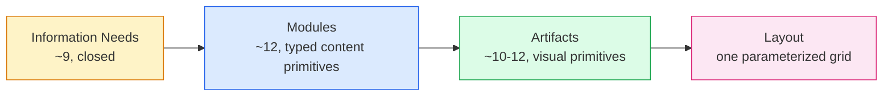
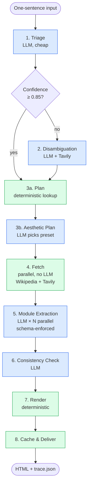

# Topic Page Generator — PRD

> Planning document for the one-week Newsbreak take-home. Not a design doc. Intended audience: me (Nick), for execution clarity.

## Contents

1. [Goal: generate topic pages a newsroom editor would publish](#1-goal-generate-topic-pages-a-newsroom-editor-would-publish)
2. [Scope this week](#2-scope-this-week)
3. [Architecture](#3-architecture)
4. [Decisions we've locked in](#4-decisions-weve-locked-in)
5. [What we ship](#5-what-we-ship)
6. [Open questions and risks](#6-open-questions-and-risks)

---

## 1. Goal: generate topic pages a newsroom editor would publish

This system takes a **one-sentence event description** and produces a **publishable hot event topic page**. The primary user is a **newsroom editor** who needs to ship topic pages within minutes of breaking news.

We deliberately sit between two extremes:

- **Not Perplexity.** We don't synthesize prose that replaces source articles. That posture undermines publisher economics and creates hallucination + copyright exposure.
- **Not a plain link aggregator.** We don't just list headlines. That adds no value over Google News.

Our middle position: **synthesize commodity facts** (dates, venues, schedules, numbers, specs) and **route original journalism** (analyst takes, named reactions, reporter coverage) back to its source via link-out. Every claim cites its source. The editor reviews and approves before publication.

---

## 2. Scope this week

### In scope

- **Python CLI generator** that takes a one-sentence input and produces a static HTML topic page.
- **Eight-stage pipeline**: Triage → Disambiguation → Plan → Fetch → Extract → Consistency Check → Render → Cache & Deliver.
- **~12 module kinds**, typed with strict schemas: `Hero`, `Infobox`, `Schedule`, `Countdown`, `KPINumbers`, `Comparison`, `Changelog`, `Reactions`, `MediaCoverage`, `OfficialStatements`, `WhereToWatch`, `Background`.
- **Single parameterized layout system** with a closed library of **4 named aesthetic presets** (`live_dominance`, `product_focus`, `imminent_event`, `reference`). The LLM picks one preset per event; falls back to `reference` on low confidence.
- **Three demo pages** built and committed: GPT-5.5 Instant rollout, Eurovision 2026, FIFA World Cup 2026. And try to generalize Trump China Visit
- **Full editor-in-the-loop via interactive CLI** — five touchpoints: low-confidence triage, unresolved disambiguation, plan override, per-module review at low confidence, final approval gate with browser preview.
- **Source citation system** with four-tier ranking (primary / independent news / reference / web), per-claim `source_ids`, AI-content blacklist, multi-source verification for commodity facts.
- **Wikipedia + Wikidata** for fact base, **Tavily** for fresh news, **OpenRouter** for cross-model testing during development (per-stage model selection finalized later).
- **`trace.json` per page** recording every pipeline stage, every editor action, model choice, cost, and duration.
- **Mobile-responsive HTML** with explicit collapse rules (Infobox immediately below Hero on narrow viewports).
- **README + DESIGN.md + this PRD** in the repo.

### Out of scope

- Interactive web UI of any kind. CLI + browser preview only.
- Hosting, deployment, Docker, CI. Brief explicitly says no.
- Multi-editor coordination, auth, permissions.
- Continuous improvement dashboard or edit-feedback analytics.
- Artifact-level LLM (chart captions, alt-text generation, copy beyond preset selection).
- Separate HTML draft-view overlay file. Editor review happens through the published HTML opened in browser plus CLI prompts.
- Localization. English output only.
- Auto-publish, scheduled publishing, push notifications, real-time post-publish updates.
- Mobile native app, subscriptions, A/B testing infrastructure.

---

## 3. Architecture

### Four-layer abstraction (open composition, closed primitives)



- **Information Needs** — bounded set of nine reader questions any event page must address: *what happened, when/where, who, current state, why it matters, world's reaction, how we know, action, what's next*. Every module declares which needs it serves; the page aggregates a `needs_coverage` map and flags any uncovered need in the trace.
- **Modules** — typed content units the system fetches and structures (e.g., `Reactions`, `Schedule`, `MediaCoverage`). Each module declares its schema, query template, extraction prompt, source-tier preferences, inclusion preconditions, and confidence calculator.
- **Artifacts** — pure visual primitives that render module data (`Timeline`, `KPITile`, `CoverageBreakdown`, `Infobox`). No LLM involvement at this layer.
- **Layout** — one parameterized grid system. The LLM picks an aesthetic preset (palette, density, typography, hero mood, copy register) from a closed library per event.

Module-to-artifact mapping is many-to-many. Module-to-need mapping is many-to-one. The parameterized layout is shared across all events; only aesthetic parameters change.

Full type definitions for every layer (sources, citations, the 12 modules, pipeline stage outputs, trace, layout config, aesthetic enums) live in [`schema.md`](./schema.md). The schema there is the source of truth for both the runtime contract and the Pydantic models.

### Eight-stage pipeline



Blue = LLM call. Green = deterministic code.

### Where the LLM lives vs deterministic code

| Stage | LLM? | Purpose |
|---|---|---|
| 1. Triage | yes | Classify event type, posture, entity; report confidence |
| 2. Disambiguation | yes | Resolve ambiguous input against search results |
| 3a. Plan | no | Map archetype → modules + slot routing (lookup table) |
| 3b. Aesthetic Plan | yes | Pick aesthetic preset + tonal parameters from closed library |
| 4. Fetch | no | Parallel HTTP to Wikipedia, Wikidata, Tavily |
| 5. Module Extraction | yes | Extract typed module data from evidence, with citations |
| 6. Consistency Check | yes | Cross-module fact and coherence check |
| 7. Render | no | Compose layout from modules + aesthetic preset |
| 8. Cache & Deliver | no | File I/O, trace persistence |

**Principle: LLMs handle fuzzy semantic tasks (classification, semantic extraction, taste judgment). Everything else is code.**

### Human-in-the-loop touchpoints

Editor prompts are injected at five points inside the pipeline:

1. **Low-confidence triage** (after Stage 1) — pick from alternative event interpretations.
2. **Unresolved disambiguation** (after Stage 2) — clarification card if still ambiguous.
3. **Plan override** (after Stage 3a, optional) — confirm archetype + module set.
4. **Per-module review** (during Stage 5) — accept / regenerate / `$EDITOR` edit / skip for any module flagged low-confidence.
5. **Final approval gate** (after Stage 7) — open `draft.html` in browser, return to CLI for approve / reject / regenerate-module.

A `--auto` flag bypasses all prompts using default actions (low-confidence accepted with flag in trace, auto-approve). Every editor action is captured in `trace.json`.

---

## 4. Decisions we've locked in

Ten decisions, each with one-line reasoning. These are settled; do not re-litigate during implementation.

1. **Product position: AI drafts, editor publishes.** Stakes out the middle ground between Perplexity-style synthesis (legal exposure, undermines publisher economics) and plain link-aggregation (no value-add over Google News).

2. **Hybrid content posture: synthesize commodity facts, link original journalism.** Rule of thumb — if the content could be a Wikidata-style field, synthesize it; if it's a sentence in a specific journalist's article, link and quote it.

3. **Bounded LLM pipeline, not a free agent loop.** Eight pipeline stages with LLM at four specific points (triage, disambiguation, aesthetic plan, extraction, consistency check). Routing, fetching, and rendering remain deterministic code.

4. **Modules are open typed primitives; archetypes are soft presets.** Avoids the closure problem — new event types do not require new schema types. Same pattern applied to the layout layer.

5. **Single parameterized layout, not N hardcoded templates.** One grid system with 4 named aesthetic presets in a closed library. New event types are new parameter points, not new layout code.

6. **Aesthetic Plan stage gives the LLM creative latitude inside a closed library.** LLM picks preset, palette, density, hero mood, copy register from enumerated options. It never writes HTML or CSS.

7. **CLI delivery, not web UI.** Take-home explicitly asks for static HTML files. CLI + browser preview + `$EDITOR` is the right human-in-the-loop form for expert users and preserves the polish budget for the actual pages.

8. **Full editor-in-the-loop with five touchpoints.** Low-confidence triage, unresolved disambiguation, plan override, per-module review, final approval gate. A `--auto` flag bypasses all prompts for batch runs.

9. **Source citations enforced at the schema layer.** Every fact-bearing field carries a non-empty `source_ids` array; schema validation rejects unsupported claims. The strongest available hallucination defense.

10. **Hallucination and misinfo defenses.** AI-generated-content blacklist (defensive response to the Reuters investigation finding of 40+ AI-misinfo incidents in news aggregators), multi-source requirement for commodity facts, audit log binding editor identity to each published page.

---

## 5. What we ship

### Repo layout at submission

```
newsbreak-takehome/
├── README.md                 — how to run, what each output is
├── DESIGN.md                 — design decisions, trade-offs, what's next
├── prd.md                    — this planning doc
├── schema.md                 — all data type definitions (source of truth)
├── .env.example              — API key names, no values
├── .gitignore
├── pyproject.toml
├── uv.lock
├── src/
│   ├── cli.py                — Typer entry point
│   ├── pipeline/             — eight stages, one file each
│   ├── modules/              — ~12 module kinds
│   ├── layout/               — parameterized grid, presets, design tokens
│   ├── prompts/              — base preamble + per-module/stage prompts
│   ├── sources/              — Tavily, Wikipedia, Wikidata, ranking
│   ├── schema.py             — Pydantic models
│   └── editor/               — interactive CLI prompts
├── templates/
│   ├── layout.html           — page scaffold
│   ├── artifacts/            — per-artifact Jinja partials
│   └── styles.css            — vanilla CSS, one file
└── output/
    ├── gpt55-instant.html / .trace.json / .data.json
    ├── eurovision-2026.html / .trace.json / .data.json
    └── worldcup-2026.html / .trace.json / .data.json
```

### Three demo events

| Event | Archetype hint | Why this event |
|---|---|---|
| GPT-5.5 Instant rolled out as default in ChatGPT | `product_launch` | Tests recent-release coverage, official source dominance, version comparison |
| Eurovision 2026 (Vienna, May 12–16) | `live_cultural_event` | Tests live posture, live ticker, social pulse, lineup |
| FIFA World Cup 2026 (June 11 kickoff at Azteca) | `scheduled_sports_event` | Tests imminent-future, countdown, tournament data, how-to-watch |

### Output files per demo event

- **`<event>.html`** — published topic page (vanilla HTML + vanilla CSS, mobile-responsive).
- **`<event>.trace.json`** — full pipeline trace plus editor session log: every stage, every editor action, model choice, cost, duration.
- **`<event>.data.json`** — raw module data (structured JSON the templates render from); used by per-module regeneration.

### Python dependencies (for review)

```toml
[project]
name = "topic-page-generator"
version = "0.1.0"
requires-python = ">=3.11"
dependencies = [
    "httpx>=0.27",            # HTTP client for Wikipedia, Wikidata, Tavily, OpenRouter
    "pydantic>=2.7",          # schema validation — the hallucination wall
    "jinja2>=3.1",            # HTML template rendering
    "typer>=0.12",            # CLI framework
    "rich>=13.7",             # terminal UI: progress bars, prompts, tables
    "openai>=1.30",           # OpenRouter client (OpenAI-compatible API)
    "tavily-python>=0.3",     # Tavily search wrapper
    "python-dotenv>=1.0",     # .env loading
    "tenacity>=8.2",          # HTTP retry logic with backoff
]

[tool.uv]
dev-dependencies = [
    "ruff>=0.4",              # linter
    "pytest>=8.0",            # tests (selective coverage)
]
```

**Nine runtime deps, two dev deps.** Each justified by a specific use. Open for review before `uv add`.

---

## 6. Open questions and risks

### Open decisions (resolve during implementation)

1. **Final per-stage LLM model selection.** OpenRouter is used during build to test models per stage; final pick driven by a cost / quality / latency benchmark on 5–10 prompts spanning the three archetypes.
2. **CSS approach.** Default plan: pure vanilla CSS in one `styles.css`. Alternative: Tailwind via CDN. Leaning vanilla for output cleanliness; revisit only if styling speed becomes a blocker.
3. **Palette roster within the closed library** of 6 (`festive_warm`, `minimal_tech`, `urgent_red`, `muted_solemn`, `bold_sport`, `neutral_news`). Each maps to a hand-crafted CSS-variable set. Adjustments allowed mid-build if a demo event clearly needs a missing tone; otherwise locked.
4. **Trace schema shape.** Custom JSON for the first pass. OpenTelemetry-compatible trace shape is a stretch goal if time permits.
5. **CLI confidence thresholds.** Defaults: triage `0.85`, module `0.80`, aesthetic `0.75`. Tunable after the first end-to-end test run.

### Risks to monitor

1. **API rate limits or provider outages during demo recording.** Mitigation: aggressive caching, record demo runs in advance (not live), configure OpenRouter fallback chain per stage.
2. **LLM picks wrong aesthetic preset for tonally complex events.** Mitigation: confidence threshold + fallback to neutral preset + editor override in CLI.
3. **Aesthetic Plan stage adds latency to the critical path.** Mitigation: parallelize with Stage 4 fetch where possible; use the cheapest acceptable model.
4. **Mobile responsive only tested in Chrome DevTools.** Mitigation: at least one real-device check before submission.
5. **Evidence richness asymmetry across the three demo events** (GPT-5.5 dense, Eurovision multilingual, World Cup official-source-heavy). Mitigation: spot-check evidence pool sizes after first fetch run; supplement thin areas with Wikipedia or official-source enrichment.
